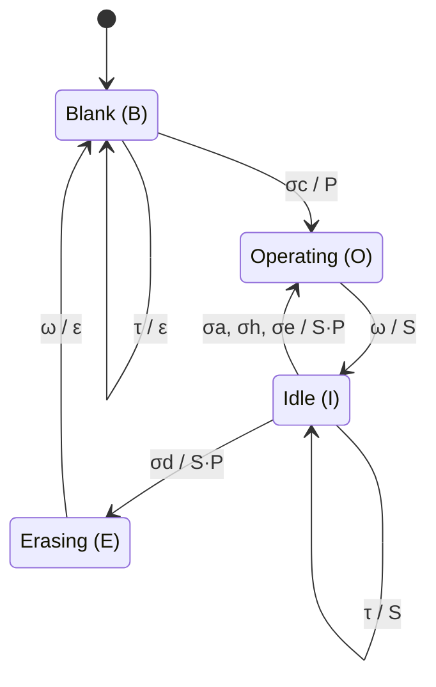

# JSON Schema

This document serves as a walkthrough, justification of design choices, and a reference for the JSON schemas constructed as part of my Capstone Thesis. The project produces two complementary schemas. The **static schema** (`static-schema.json`) captures a flowchart at a single point in time — its nodes, connections, hierarchy, board state, and semantic context. The **operation schema** (`operation-schema.json`) captures what an instructor does to a flowchart over the course of a lecture video — each detected action is classified, timestamped, and documented with evidence. Together, the two schemas provide both the spatial and the temporal dimensions needed to make lecture flowcharts accessible to visually impaired students.

The first step to reaching here was to explore what the requirements are for an IR — that is, what data it needs to capture. For this, we constructed a table that outlines the information to be included, why it needs to be included, what literature supports this, instances observed in the videos watched for literature review, and what annotating them would look like.

The table can be found here: [Thesis IR Requirements](https://docs.google.com/spreadsheets/d/1AntonupgmWn9se1v5Xf6j6UbX7Bw4INg9vhZyAFw5qQ/edit?usp=sharing)

---

## Why JSON?

The first question after all this analysis is what representation language to use to capture all this data. Some options that we considered were Mermaid, XML, and UML. However, for the long-term development goals of the project, JSON seemed the most suitable. This can be explained as follows:

- **Data model flexibility:** JSON makes no assumption about whether data is a tree or a graph [1], so hierarchy and graph connectivity sit naturally side by side in the same document. XML is fundamentally a tree and forces you to abandon nesting to express graph connections, ending up with the same ID reference pattern as JSON but with more syntax overhead. Mermaid is a rendering DSL — it has no document model at all, just a string that a renderer interprets. UML has a metamodel that can express both but requires a heavy toolchain (XMI serialization) to actually store it.

- **Change tracking:** JSON Patch [2] provides a standardised way to record what changed between versions as a sequence of operations, directly satisfying the temporality requirement without storing full snapshots. XML has no equivalent standard for delta tracking — you either diff the full document or implement your own change format. Mermaid has no versioning concept whatsoever — it is a static string. UML versioning is tool-dependent and not standardised across implementations.

- **Parse simplicity:** A single `JSON.parse()` call [3] is all a student's assistive technology needs, with no generated decoder code, no schema compilation, and no binary decoding library. XML requires a DOM or SAX parser which, while available in browsers, is substantially more verbose to use. Mermaid requires its own rendering library to be loaded before anything can be interpreted. UML/XMI has no browser-native parser at all.

- **Performance:** XML is measurably slower than JSON in transmission speed and payload size [4], compounding across every incremental update in a live session. Mermaid and UML are not designed for real-time streaming at all and have no performance profile relevant to this comparison.

- **Extensibility:** JSON places no restrictions on what data you add to a document, so fields like plain-language node descriptions, symbol dictionaries, and annotation metadata can be added wherever needed without fighting the format. JSON Schema [5] can then optionally enforce that these fields are present before a tool attempts to render or speak the content. XML technically allows custom elements but its schema system (XSD) is complex enough that adding new accessibility fields in practice means significant schema maintenance overhead. Mermaid is a closed rendering syntax — there is nowhere to attach custom contextual data without it breaking the renderer. UML supports tagged values for custom data but they are tool-specific, meaning custom accessibility fields added in one UML tool will not reliably survive export to another.

**References**

[1] T. Bray, Ed., "The JavaScript Object Notation (JSON) Data Interchange Format," RFC 8259, IETF, December 2017. https://datatracker.ietf.org/doc/html/rfc8259 — See also ECMA-404, 2nd edition (December 2017), which explicitly states that JSON's intent "is not to provide any semantics or interpretation of text conforming to that syntax."

[2] P. Bryan and M. Nottingham, "JavaScript Object Notation (JSON) Patch," RFC 6902, IETF, April 2013. https://datatracker.ietf.org/doc/html/rfc6902

[3] ECMA International, "ECMAScript Language Specification," ECMA-262, Section 25.5.1. `JSON.parse()` has been a built-in global function since ES5 (December 2009) and is supported by every modern browser. https://262.ecma-international.org/

[4] N. Nurseitov, M. Paulson, R. Reynolds, and C. Izurieta, "Comparison of JSON and XML Data Interchange Formats: A Case Study," Proc. 22nd International Conference on Computer Applications in Industry and Engineering (CAINE), 2009. https://www.cs.montana.edu/izurieta/pubs/IzurietaCAINE2009.pdf

[5] A. Wright, H. Andrews, B. Hutton, and G. Dennis, "JSON Schema: A Media Type for Describing JSON Documents," JSON Schema Specification, 2020-12. https://json-schema.org/draft/2020-12/json-schema-core

---

## Logical Groupings

From the requirements table, all the needs were divided into four categories. These groupings informed the design of both schemas — the static schema directly encodes Elements, Structure, State, and Semantics as its top-level categories, while the operation schema captures the temporal and dynamic aspects (how elements change over time) that were originally part of the State category but required a separate schema to represent properly.

The groupings together describe a flowchart as a layered system that encodes visual form, organization, behavior, and meaning. The Elements group refers to the basic visible components — nodes and their connections — along with their explicit visual attributes, which make the diagram perceptible and readable. Structure captures how these components are arranged into higher-order organization, such as hierarchy, compacted or abstracted views, and links across multiple flowcharts, allowing navigation between different levels of detail. State captures the current snapshot of the board — spatial positioning, cross-flowchart relationships, and progressive disclosure for complexity management. Finally, Semantics provides interpretive depth through domain-specific symbols and annotations, transforming the diagram from a purely graphical layout into a comprehensive representation, ensuring the computational and informational equivalence of the flowcharts.

| Category | Static Schema Contents | Operation Schema Relevance |
|----------|----------------------|---------------------------|
| **Elements** | Nodes, Connections (with explicit visual attributes) | Referenced in operation content descriptions |
| **Structure** | Hierarchy, Compacted Version, Cross-flowchart Links | Structural changes tracked as operations |
| **State** | Board State, Cross-Links, Compacted View | Temporality and replication captured as operation sequences |
| **Semantics** | Symbol Support, Annotations | Pedagogical context captured per-operation |

---

## Static Schema

### JSON Schema Essentials

The metadata for the JSON specifies the stable version used, the version of the schema, title, description, type, required keys, and sets `additionalProperties` as false to take a strict approach.

### ID

This sets a unique ID for the particular flowchart being represented; this is different from the JSON `$id` field, which refers to the version of the entire schema itself. Each flowchart is identified by a timestamp by setting the format as `date-time`.

---

### Elements

The category elements has two required properties - nodes and connections. These are the most basic data fields, but cover the essential data.

#### Nodes

Node is defined as a list, and then `items` is used to enforce that all elements in the array must conform to the sub-schema defined inside items. Now, nodes have three required properties - shape, text, id. The shapes are constrained to certain common ones; this could be extended as more shapes are observed. The text inside node is stored as a string. The position and visual attributes are abstracted away for both nodes and connections and defined later with just a colour key right now. A flowchart is defined only if there is atleast 1 node.

#### Connections

Connections are also defined as a list of objects. Each connection requires three properties - id, source, and target. The source and target are string references to node IDs, establishing the graph edges. Beyond these required fields, connections carry optional metadata: `direction` indicates the arrow direction using one of four values (forward, backward, bidirectional, or none), defaulting to forward. This separates the visual arrow direction from the structural source-target relationship — a backward connection keeps its source and target as listed but draws the arrow in reverse. The `line_type` field specifies the visual style of the connection (solid, dashed, or dotted), defaulting to solid. An optional `label` field stores any text displayed on or near the connection, such as "Yes" or "No" on decision branches. Like nodes, connections also carry an optional visual attribute reference for colour.

---

### Structure

The structure category currently contains one property — hierarchy.

#### Hierarchy

Hierarchy is defined as an array of group objects, where each group has three required properties: id, parent, and children. The `parent` field accepts either a string (pointing to another group's ID for nesting) or null (for flat, top-level groupings). This dual-type approach was a deliberate choice — by keeping parent required but nullable, every group must explicitly declare whether it is nested or top-level, preventing ambiguity between "intentionally flat" and "parent was forgotten." The `children` field is an array of strings referencing node IDs or sub-group IDs, with a minimum of one item — a group with no children would be semantically meaningless. An optional `label` field provides a human-readable name for the group.

---

### State

The state category captures the current, dynamic aspects of the board at any given moment. It contains three properties: `cross_links`, `compacted`, and `board_state`.

#### Cross-Links

`cross_links` handles the multi-flowchart case — when a whiteboard contains several flowcharts that reference each other. Each cross-link is an object with four required fields: `source_flowchart` and `target_flowchart` (the IDs of the two flowcharts involved) and `source_element` and `target_element` (the IDs of the specific elements being linked across those flowcharts). An optional `label` can describe the nature of the relationship. This means the IR is not just a single-graph format; it is aware of a broader board context where multiple flowcharts coexist and interact.

#### Compacted

Compacted provides the progressive disclosure mechanism, which is critical for accessibility. A complex flowchart with many nodes would be overwhelming for a screen reader to traverse in full. Compacted addresses this through three sub-properties. The `detail_level` field uses `oneOf` with `const` values rather than a plain enum, so that each level carries its own description: "full" means all nodes and connections are visible, "summary" means collapsed groups are shown as single summary nodes, and "minimal" means only the top-level flow with group summaries is presented. The `collapsed_groups` field is an array of hierarchy group IDs that are currently collapsed. The `summaries` field pairs each collapsed group with a plain-text summary, so that a screen reader can announce "This section handles error recovery with 8 steps" rather than reading all 8 nodes individually.

#### Board State

`board_state` is a plain-text string that captures an overall description of the current board state. This replaces what was previously a more granular spatial data object with viewport and bounds properties; a free-form string was chosen instead because the exact viewport coordinates are less useful for accessibility purposes than a human-readable description of what is currently happening on the board.

---

### Semantics

The semantics category transforms raw graph data into something meaningful for non-visual consumption. It contains two properties: `symbols` and `annotations`.

#### Symbols

Symbols serves as a legend — a lookup table that maps visual conventions to their semantic meaning. Each entry has two required fields: `symbol` (a string like "diamond" or "dashed line") and `meaning` (a description like "decision point" or "optional path"). An optional `applicable_to` array lists the IDs of elements that use this symbol. This is critical for accessibility because sighted users absorb shape conventions visually — everyone "knows" a diamond is a decision — but that knowledge must be made explicit for non-visual consumption. By making this a per-flowchart table rather than hardcoding it, the schema supports non-standard conventions, such as an instructor using triangles for something domain-specific.

#### Annotations

Annotations captures interpretive overlays — things an instructor draws on top of the flowchart as meta-commentary, such as circling a critical node, drawing an arrow to a common mistake, or adding a cloud with a note. Each annotation has three required fields: `id`, `target` (the ID of the annotated element), and `annotation_type` (one of eight values: container, separator, highlight, circle, underline, arrow, cloud, or strikethrough). An optional `content` field, which can be a string or null, stores the text attached to the annotation. For accessibility, this field is what converts a visual gesture (a red circle around a node) into a communicable description ("I circled this node because it is the most common source of bugs").

### Provenance

Provenance is a required top-level property. It records metadata about the AI pipeline that generated the IR, along with quality signals that let downstream consumers judge how much to trust the output.

Provenance has four required fields. The `model` field records the identifier of the model used to generate the IR (for example, "gemini-2.5-flash"). The `confidence` field references a shared `confidence_level` definition (high, medium, or low), providing a self-assessed quality signal about the overall accuracy of the generated IR. The `visibility_issues` field is either a string describing problems that may have degraded the IR's accuracy (glare, hand occlusion, low resolution) or null when no issues were encountered — this was deliberately made nullable rather than using a string convention like "None" so that the absence of issues is structurally unambiguous. The `time_taken` field records the wall-clock duration of the analysis in MM:SS format — how long the analysis took is more operationally useful than when it happened.

One optional field supports agentic pipeline runs: `reasoning_steps`, an integer recording how many reasoning steps the agentic pipeline executed.

### Reasoning Process

`reasoning_process` is an optional top-level property (a sibling of `elements`, `structure`, `state`, `semantics`, and `provenance`). It stores the model's intermediate reasoning trace as a raw string, or null when no reasoning was recorded. This field was deliberately separated from provenance — provenance describes *what* produced the IR and *how confident* it is, while the reasoning process captures *how* the model arrived at its interpretation. A string type was chosen over a structured object because agentic reasoning output is unpredictable in shape, and pretending it has structure would create a validation hole.

---

### Shared Definitions (`$defs`)

At the bottom of the schema, the `$defs` section contains three reusable sub-schemas referenced throughout the document via `$ref`. The **position** definition is a simple object with two required numeric fields, x and y, representing a point in 2D space. It is used by node positions and can be referenced wherever spatial coordinates are needed. The **visual_attrs** definition is an object currently containing a single optional colour field. The **confidence_level** definition is a string enum constrained to "high", "medium", or "low", shared with the operation schema to maintain a consistent quality vocabulary across both schemas. All three definitions use `additionalProperties: false` to maintain the same strict approach as the rest of the schema. Abstracting these into `$defs` avoids duplication — any property that references position, visual attributes, or confidence levels points to the same definition, so a change in one place propagates everywhere.

---

## Conventions

These conventions govern how the static IR should be authored, whether by hand or by an AI pipeline, to ensure consistency across encodings.

### Flowcharts vs. Annotations

A flowchart is defined as the set of all elements that are connected to each other — nodes linked by connections form a single coherent graph. Anything that is added to the board but is not structurally connected to this graph is classified as an annotation. For example, if an instructor draws a circle around a node or writes a note next to it without connecting it via an edge, that overlay belongs in the `annotations` array under semantics, not as a node in `elements`. The distinction is structural: if it participates in the graph (has connections), it is part of the flowchart; if it is overlaid on the graph without being part of it, it is an annotation.

### Node and Connection Numbering

Nodes are numbered left to right, level by level. The topmost (or leftmost, depending on flowchart orientation) node is `n1`. All nodes at the same depth level are numbered before descending to the next level. Within a level, numbering proceeds from left to right. Connections follow the same principle — `c1` is the first connection encountered when traversing the flowchart in this level-order sequence. This convention ensures that any two people encoding the same flowchart will produce the same ID assignments, which is critical for reproducibility and for cross-referencing between the static IR and operation schema outputs.

### Hierarchy and Nested Groupings

When representing hierarchical relationships, every descendant node must be listed as a direct child of the relevant parent group, regardless of how deeply nested it is in the visual layout. That is, if node A contains group B which contains node C, then C must appear in B's `children` array — but if A is the root group, then B (the sub-group) must also appear in A's `children` array. This "flattened children" approach was chosen over implicit nesting for clarity: a consumer traversing the hierarchy does not need to recursively resolve sub-groups to discover which nodes belong to a parent. The `parent` field on each group handles the nesting direction (child points to parent), while `children` handles the containment direction (parent lists all direct contents). Both directions are always explicit.

---

## Operation Schema

The operation schema (`operation-schema.json`) formalises the output of a video analysis pipeline. Where the static schema captures what a flowchart looks like at a single point in time, the operation schema captures what an instructor does to a flowchart over the course of a lecture video — detecting, classifying, and describing every flowchart-related action performed by the instructor.

### Top-Level Structure

The operation schema has two required top-level properties: `provenance` and `analysis`. This split separates provenance (how the analysis was produced and how confident it is) from findings (what was detected). The provenance object mirrors the static schema's provenance structure with additional video-specific fields, ensuring a consistent quality vocabulary across both schemas.

### Provenance

Provenance records the conditions under which the analysis was run and the quality signals associated with it. It has seven required fields. The first four — `model`, `confidence`, `visibility_issues`, and `time_taken` — mirror the static schema's provenance exactly, maintaining a consistent interface for downstream consumers. The remaining three are operation-specific: `video_file` (the source video filename), `frame_rate` (the fps at which the video was sampled — provenance only, since operations reference timestamps rather than frame numbers), and `analysis_timestamp` (an ISO 8601 timestamp of when the analysis was produced). An optional `reasoning_steps` field records how many agentic reasoning steps were executed, present only when the agentic pipeline was used.

### Analysis

The analysis object is the payload. It contains three required properties: `metadata` (about the results), `operations` (the detected actions), and `summary` (aggregate counts and observations).

#### Analysis Metadata

Analysis metadata describes the results themselves, distinct from provenance which describes the run. It has two required fields. The `video_duration` field records the total duration of the analysed segment in MM:SS format. The `total_operations_detected` field is an integer count that should match the length of the operations array — it serves as a redundant cross-check.

#### Operations

Operations is a chronologically ordered array. Each operation represents a single detected instructor action on a flowchart and carries eight required fields, making every detection heavily documented for auditability.

The `operation_id` is a sequential integer starting from 1, implying chronological order. The `timestamp_start` and `timestamp_end` fields bound the action temporally in MM:SS or MM:SS.mmm format — start means the first visible change (first stroke), end means the completion (last stroke). The `operation_type` field classifies the action into one of five categories (defined below). The `confidence` field is a per-operation high/medium/low assessment, distinct from the overall confidence in provenance.

The `physical_action` object captures what the instructor physically did — a natural language `description` and a `tool_used` field constrained to an enum of six values: marker, digital pen, eraser, pointer, slide transition, or other. Physical action is separated from semantic meaning because the same physical gesture (drawing a circle) could be an ADDITION (new node) or a HIGHLIGHTING (circling an existing node), so physical action alone does not determine classification.

The `classification_reasoning` object is an audit trail. It contains `criteria_met` (which taxonomy rules were satisfied), `distinguishing_features` (what visual evidence drove the classification), and `edge_cases_considered` (ambiguities the model weighed). This exists because the analysis prompt provides the model with an explicit decision tree and requires it to show its work, making every classification contestable by a human reviewer.

The `content_description` object bridges raw observation and educational meaning through three fields: `semantic_content` (high-level summary of meaning), `diagram_elements` (specific elements involved, as an array of strings — may be empty for erasure operations), and `pedagogical_context` (why this action matters in the lecture's teaching flow).

The `visual_evidence` object is the grounding mechanism. It contains `before_state` and `after_state` descriptions (both required), plus an optional `frame_references` object with `start` and `end` timestamp fields pointing to specific frames as evidence. The before/after pair makes each operation independently verifiable.

#### Summary

The summary object provides aggregate counts for each operation type — `creation_count`, `addition_count`, `highlighting_count`, `erasure_count`, and `complete_erasure_count` — each of which must equal the number of operations of that type in the operations array. Two additional array fields, `key_observations` and `challenges_encountered`, capture qualitative patterns and difficulties observed across the full video.

---

### Operation Definitions

The operation schema classifies every detected action into exactly one of five mutually exclusive types. There is no "OTHER" category — ambiguous cases must still be classified, with uncertainty surfaced through the confidence field and edge_cases_considered in the reasoning.

#### CREATION

Initial construction of a flowchart on a blank or recently erased surface. All of the following must be true: the action is preceded by a blank slate or a complete erasure; new flowchart elements appear forming a coherent diagram; no pre-existing flowchart components remain visible; and the action marks the beginning of a new diagrammatic context. Visual signatures include an empty board followed by drawing, or a post-erasure surface where a new diagram starts.

#### ADDITION

Adding new substantive components to an existing flowchart. All of the following must be true: a pre-existing flowchart is visible and remains intact; no erasure has occurred since the last operation; new content appears (nodes, arrows, text labels, connections); and the new elements provide new semantic content, not emphasis. The critical distinction from HIGHLIGHTING is that ADDITION adds meaning — a new node, a new branch, a new label — while HIGHLIGHTING annotates existing meaning.

#### HIGHLIGHTING

Overlaying temporary visual emphasis on existing flowchart elements. All of the following must be true: pre-existing flowchart elements remain unchanged; visual marks are overlaid on existing content; the purpose is emphasis, enumeration, or reference rather than new content; and the marks are typically temporary or stylistically distinct from the flowchart itself. Visual signatures include circles drawn around existing nodes, underlines beneath text, colour changes to existing elements, arrows pointing to existing components, or numbering of existing elements.

#### ERASURE

Removing specific parts of a flowchart while preserving the overall diagram. All of the following must be true: a pre-existing flowchart is visible; specific elements or regions are removed; other parts of the flowchart remain intact; and an entity-to-whole relationship is maintained (a part is removed, but the whole continues to exist). Visual signatures include a single node or arrow being removed, a text label being wiped away, or a section of the diagram being cleared.

#### COMPLETE_ERASURE

Total removal of an entire flowchart diagram. All of the following must be true: a previously visible flowchart exists; all components of that flowchart are removed; the result is a blank surface or preparation for a new topic; and the action marks the end of a diagrammatic context. Visual signatures include an entire board or region being cleared, all flowchart elements disappearing, or a slide transition that removes the diagram. This often signals a topic or context shift in the lecture.

#### Classification Decision Tree

The five types are disambiguated through a decision tree. First: is there any pre-existing flowchart visible? If no, the action is CREATION. If yes: is something being removed? If removal is occurring, is the entire flowchart removed (COMPLETE_ERASURE) or only parts of it (ERASURE)? If nothing is being removed but something is being added, does it carry new semantic content (ADDITION) or does it annotate existing content (HIGHLIGHTING)?

---

### Shared Definitions (`$defs`) — Operation Schema

The operation schema's `$defs` section contains reusable sub-schemas that parallel the static schema's approach. **confidence_level** is a string enum (high, medium, low) referenced by both the provenance confidence and per-operation confidence fields — the same vocabulary as the static schema's `confidence_level` definition, ensuring consistency across both schemas. **operation_type** encodes the five-class taxonomy as a string enum with a description that summarises all five types. The remaining definitions — **provenance**, **analysis**, **analysis_metadata**, **operation**, **physical_action**, **classification_reasoning**, **content_description**, **visual_evidence**, and **summary** — are each defined once and referenced via `$ref` to avoid duplication within the schema.

---

## System Integration

The static schema and operation schema are designed to work together as complementary views of the same underlying process. Their integration follows three rules:

**Operations trigger the operation schema.** When an instructor performs a detectable action on a flowchart — drawing, adding, highlighting, erasing, or clearing — the operation schema is used to classify, describe, and timestamp that action. Each operation is a discrete event with temporal bounds, a classification, and evidence.

**State boundaries trigger the static schema.** To ensure that spatial and structural data is captured alongside the temporal operation data, the system generates a static schema instance at the beginning and end of each detected operation. These before-and-after snapshots preserve the full graph state (nodes, connections, hierarchy, semantics) at the moments immediately surrounding each change, providing the structural context that the operation schema's free-text descriptions cannot.

**Idle board states trigger the static schema.** Whenever there is no active change happening but a flowchart is visible on the board, a static schema instance is generated for it. This covers the common lecture pattern where an instructor draws a flowchart, pauses to explain it verbally for several minutes, and then modifies it. During the explanation pause, the static IR captures the current state so that it is available for accessibility tools without waiting for the next operation to provide before/after context.

### Integration Protocol — Formal Definition

The integration protocol is modeled as a Mealy machine — a finite state transducer that produces output on each transition rather than in each state. This is the appropriate formalism because schema generation is triggered by events (an operation starts, an operation ends, time passes with no change), not by residency in a particular state.

**Definition.** Let *M* = (*Q*, *Σ*, *Γ*, *δ*, *λ*, *q*₀) be a Mealy machine where:

**State set** *Q* = {*B*, *I*, *O*, *E*}

| State | Name | Interpretation |
|-------|------|----------------|
| *B* | Blank | No flowchart is present on the board. |
| *I* | Idle | A flowchart is present and no operation is in progress. |
| *O* | Operating | A non-destructive operation is in progress (CREATION, ADDITION, HIGHLIGHTING, or ERASURE). |
| *E* | Erasing | A COMPLETE_ERASURE is in progress. |

The distinction between *O* and *E* is necessary because they differ in their terminal state: *O* always resolves to *I* (the flowchart survives the operation), while *E* always resolves to *B* (the flowchart is destroyed). All four non-destructive operation types share the same transition behaviour, so they are collapsed into a single state.

**Input alphabet** *Σ* = {*σ*_c, *σ*_a, *σ*_h, *σ*_e, *σ*_d, *ω*, *τ*}

| Symbol | Event |
|--------|-------|
| *σ*_c | CREATION begins (first stroke on blank surface) |
| *σ*_a | ADDITION begins (new content added to existing flowchart) |
| *σ*_h | HIGHLIGHTING begins (emphasis overlaid on existing content) |
| *σ*_e | ERASURE begins (partial removal of flowchart elements) |
| *σ*_d | COMPLETE_ERASURE begins (total removal of flowchart) |
| *ω* | Current operation completes |
| *τ* | Time elapses with no detected change |

**Output alphabet** *Γ* = {*S*, *P*, *S*·*P*, *ε*}

| Symbol | Schema action |
|--------|--------------|
| *S* | Generate a static IR instance (snapshot of current board state). |
| *P* | Generate an operation schema entry (classify and describe the detected action). |
| *S*·*P* | Generate both: a static IR snapshot (before-state), then an operation schema entry. |
| *ε* | No schema output. |

**Initial state** *q*₀ = *B*

**Transition function** *δ* : *Q* × *Σ* → *Q*

| Current state | Input | Next state | Justification |
|---------------|-------|------------|---------------|
| *B* | *σ*_c | *O* | A flowchart is being created on a blank surface. |
| *B* | *τ* | *B* | Board remains blank; nothing to capture. |
| *I* | *σ*_a | *O* | Existing flowchart is being extended. |
| *I* | *σ*_h | *O* | Existing flowchart is being annotated. |
| *I* | *σ*_e | *O* | Part of the flowchart is being removed. |
| *I* | *σ*_d | *E* | Entire flowchart is being erased. |
| *I* | *τ* | *I* | Flowchart persists unchanged. |
| *O* | *ω* | *I* | Non-destructive operation completes; flowchart survives. |
| *E* | *ω* | *B* | Complete erasure finishes; board is blank. |

All (*q*, *σ*) pairs not listed above are undefined — the machine rejects the input. In particular, *σ*_c is only valid from *B* (by definition, CREATION requires a blank surface), and *σ*_a, *σ*_h, *σ*_e, *σ*_d are only valid from *I* (they require a pre-existing flowchart). No input is accepted from *O* or *E* other than *ω* (operations are atomic and non-interruptible).

**Output function** *λ* : *Q* × *Σ* → *Γ*

| Current state | Input | Output | Rationale |
|---------------|-------|--------|-----------|
| *B* | *σ*_c | *P* | No flowchart exists to snapshot; only the operation entry is generated. |
| *B* | *τ* | *ε* | Empty board, nothing to record. |
| *I* | *σ*_a | *S*·*P* | Snapshot the current state before the change, then record the operation. |
| *I* | *σ*_h | *S*·*P* | Snapshot the current state before the change, then record the operation. |
| *I* | *σ*_e | *S*·*P* | Snapshot the current state before the change, then record the operation. |
| *I* | *σ*_d | *S*·*P* | Snapshot the current state before destruction, then record the operation. |
| *I* | *τ* | *S* | Maintain/refresh the static IR for the idle flowchart. |
| *O* | *ω* | *S* | Snapshot the resulting state after the operation completes. |
| *E* | *ω* | *ε* | Board is blank after complete erasure; no flowchart to snapshot. |

**Properties.**

1. *Schema completeness.* Every operation is bracketed by static IR snapshots: the before-snapshot is emitted on the transition into *O* or *E* (output *S*·*P*), and the after-snapshot is emitted on the transition out of *O* (output *S*). The exception is CREATION (no before-snapshot, since *B* has no flowchart) and COMPLETE_ERASURE (no after-snapshot, since *B* has no flowchart). In both cases, the missing snapshot is the empty board — a trivially reconstructible state.

2. *Idle coverage.* The self-loop (*I*, *τ*) → (*I*, *S*) ensures that a flowchart is captured even when the instructor is not actively modifying it. This covers explanation pauses, discussion periods, and any interval where the diagram is visible but static.

3. *Determinism.* The machine is deterministic — for every (*q*, *σ*) pair where a transition is defined, exactly one next state and one output are produced.

4. *No accepting states.* The machine runs continuously for the duration of the lecture video. There is no halting condition intrinsic to the protocol; the machine terminates when the video ends.

*Figure 1. Mealy machine for the integration protocol. Transition labels are input / output. States B and I are quiescent (no operation in progress); states O and E are transient (an operation is active).*

Text description of Figure 1 (for screen readers and non-visual access)

The diagram is a state machine with four states and nine transitions.

**States:** Blank (B), Idle (I), Operating (O), Erasing (E). The initial state is Blank.

**Transitions:**
- Blank to Operating: on CREATION start, output an operation entry (P).
- Blank to Blank (self-loop): on idle time, no output.
- Idle to Operating: on ADDITION, HIGHLIGHTING, or ERASURE start, output a static snapshot then an operation entry (S·P).
- Idle to Erasing: on COMPLETE_ERASURE start, output a static snapshot then an operation entry (S·P).
- Idle to Idle (self-loop): on idle time, output a static snapshot (S).
- Operating to Idle: on operation completion, output a static snapshot (S).
- Erasing to Blank: on operation completion, no output.

**Reading the diagram:** Blank and Idle are rest states — the system waits for an event. Operating and Erasing are transient — the system is inside an active operation. Every non-destructive operation returns to Idle (the flowchart survives); complete erasure returns to Blank (the board is empty).

